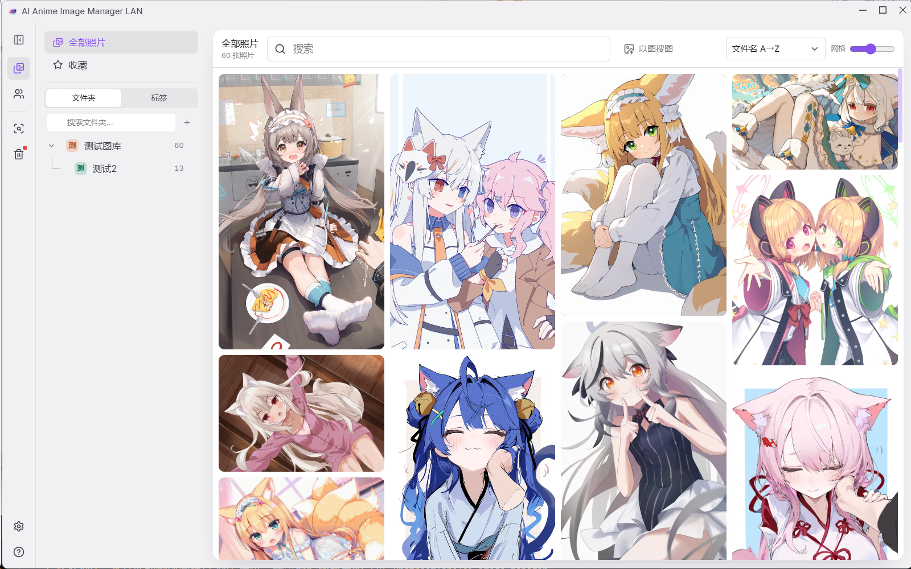
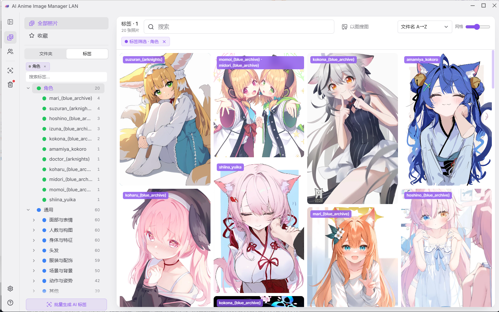
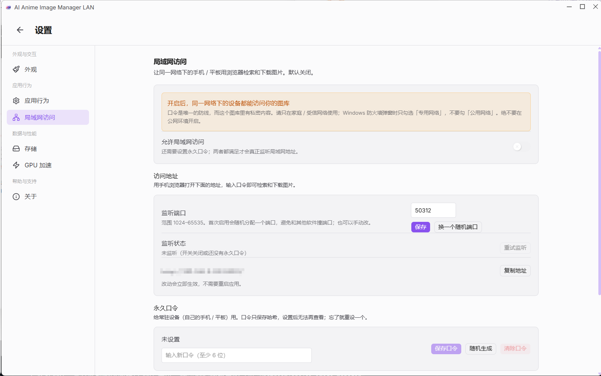

# AI Anime Image Manager LAN（局域网版 · 自用修改）

> **本项目是「AI Image Manager」的修改版** —— 基于 [Uyoung666/ai-image-manager](https://github.com/Uyoung666/ai-image-manager) **v2.2.3** 修改而来。
> 上游采用 MIT License（Copyright © 2025 Luan Roger）；本仓库为个人自用修改版，与上游作者无关。

基于 **[Uyoung666/ai-image-manager](https://github.com/Uyoung666/ai-image-manager) v2.2.3**（MIT License，Copyright © 2025 Luan Roger）的**个人自用修改版**。
上游原始源码就在本目录的 `upstream/ai-image-manager-v2.2.3.zip` 里，**自包含**：

```
upstream/ai-image-manager-v2.2.3.zip     ← 上游 v2.2.3 原始源码（SHA256: b3679a512ea3298e2693a8d457b5485521aa7e69fe8e50874d89b0564fefc7ee）
upstream/src/ai-image-manager-2.2.3/     ← 本版本的工作树（= 上游 + 补丁）
patches/                                  ← 相对上游的补丁（干净解压 + git apply 可逐字节还原本工作树）
```

## 功能



<p align="center"><em>主界面（与本地版一致）</em></p>


### 继承自上游的能力

| 功能 | 说明 |
|---|---|
| **图像管理** | 添加任意文件夹，自动索引、生成缩略图、按目录树浏览 |
| **重复图像识别** | 感知哈希比对，找出重复/近似重复的图，支持分组查看 |
| **以图搜图** | 用一张图去找相似的图 |
| **语义搜索** | 用自然语言描述画面找图 |
| **收藏 / 日期 / 文件夹筛选** | 按时间范围、按目录快速过滤 |

### 本版独有：动漫化标签体系

> 上游的 AI 打标是为**真人摄影**设计的（153 个英文概念），套在动漫插画上产出的是噪声
> （本机实测出现过「猫咪 42,632 张」）。本版换成 **Danbooru 标签体系**并重建了整个标签系统。

| 功能 | 说明 |
|---|---|
| **WD14 自动打标** | 10,861 个 Danbooru 标签（角色 2,751 + 通用 8,106）；平均 **41 个标签/张**，**0.23 秒/张**（CPU）|
| **角色识别** | 直接认出是哪个角色（如 `hatsune_miku`、`ganyu_(genshin_impact)`）|
| **通用标签中文化** | 落库为 `中文 (english)`，如 `长发 (long_hair)` → **中文和英文都能搜** |
| **标签二级分类** | `通用` 下按 **13 个类型**建目录（头发 / 服装与配饰 / 面部与表情 …），不再平铺 |
| **只显示有图的标签** | 词表一万多个，只渲染库里真正用到的（实测 10,933 个里只有 551 个有图）|
| **标签黑名单** | 右键移入；集中到面板**底部固定区域**，不随标签树滚动；左键筛选、右键移出；**只影响显示不删数据** |
| **标签重命名** | 只改中文显示名，**英文标识自动保留在括号里** → 标签身份恒定，中英文检索始终有效 |
| **标签颜色** | 支持十六进制（`#f97316`、`#f93`）和 RGB（`rgb(249,115,22)`）；一级子树按归属共用颜色 |
| **批量打标签 / 全库重跑** | 多选批量加标签；「生成 AI 标签」按钮支持全库重跑，**可断点续跑**，手动标签不受影响 |



<p align="center"><em>标签树：动漫化标签体系</em></p>

### 本版独有：其他改动

| 功能 | 说明 |
|---|---|
| **应用内回收站** | 删除时原文件移入 `<图库>/回收站/`，**30 天自动清理**，可恢复且**恢复后日期不变**；移动失败则不删库记录 |
| **界面精简** | 隐藏 仪表盘 / 相册 / 选片 / 云端 / 序列 / EXIF 筛选 / 7 个设置页（**代码保留，可恢复**）|
| **照片右键精简** | 去掉「导出」「添加到相册」；多选时**只剩「收藏」和「删除」**；新增右键「多选」 |
| **搜索界面精简** | 去掉「试试这样搜索」引导区与示例词（**保留**日期快捷筛选和标签建议）|
| **监听器精简** | 上游每个子文件夹建一个监听器（本机 4,414 个）→ **只监听根目录** |
| **开机增量补扫** | 关机期间存进目录的图，开机后自动补上 |
| **新图自动处理** | 软件开着时存进来的图会自动索引 + 打标 |
| **以图搜图升级** | 改用 WD14 动漫特征（实测区分同一角色的能力约为通用模型的 **2.7 倍**）|


### 🖥️ 本版独有（LAN 版）：局域网查看

让内网其他设备（手机 / 平板）也能浏览和检索你的图库。

| 功能 | 说明 |
|---|---|
| **端口配置** | 设置里可指定监听端口（默认建议 47820）|
| **双口令** | **一个永久口令**（长期有效）+ **一个临时口令**（默认 24 小时，可选 1 / 3 / 6 / 12 小时）|
| **口令可见可改** | 设置页里明文显示/设置两个口令，方便发给别人 |
| **局域网检索** | 手机浏览器打开 `http://<电脑IP>:<端口>` 即可搜索、浏览 |
| **保存图片** | 远程设备可下载原图 |
| **手机网页** | 独立的简洁移动端页面（不是把桌面界面搬过去）|
| **🔒 网络端只读** | 通过网络访问时**禁用删除和标签编辑** —— **服务端强制**（根本不开放写接口），不是只藏按钮 |
| **默认关闭** | 该功能默认关闭；开启时明确提示"同网段设备都能访问你的图库" |

**安全提醒**：开启后同一网段内的设备都能访问，口令是唯一防线；Windows 防火墙首次会弹窗，
**只勾「专用网络」，不要勾「公用网络」**；不要暴露到公网。




<p align="center"><em>局域网访问设置：端口 + 永久/临时双口令（默认关闭）</em></p>

## 校验补丁（可复现）

```powershell
# 1) 解压上游源码，得到 ai-image-manager-2.2.3/
# 2) 套补丁
cd ai-image-manager-2.2.3
git apply --whitespace=nowarn ../patches/lan.patch
# 3) 与 upstream/src/ai-image-manager-2.2.3/ 逐字节比对 → 应完全一致
```
本补丁已按上面流程验收：**逐字节全部一致，`git apply` 退出码 0**。

## 下载（网盘）

| 内容 | 链接 |
|---|---|
| **三个版本的直装包（MSI）** | <https://pan.baidu.com/s/17cWEESG8xjdpgqCWtIvsVA?pwd=6666>　提取码：`6666` |
| 模型（WD14 打标）| https://huggingface.co/SmilingWolf/wd-vit-tagger-v3 |
| 模型（SigLIP 语义搜索）| https://huggingface.co/Xenova/siglip-base-patch16-224 |
| 模型（中文翻译 opus）| https://huggingface.co/Xenova/opus-mt-zh-en |
| 模型（人脸 SFace / YuNet）| https://github.com/opencv/opencv_zoo |

> ⚠️ **版本号仍是 2.2.3**：如果你装过同一版本的旧安装包，请**先卸载旧的、再装新的**（卸载不会删图库和设置）。

## 构建

```powershell
npm install
node node_modules/@electron-forge/cli/dist/electron-forge.js make
```
> 必须从**纯 ASCII 路径**构建（例如 `F:\AIM-build`），中文/空格路径会让 WiX 的 `light.exe` 失败。
> 打包产物在 `out/make/`（MSI + Squirrel + 便携 ZIP）。

## 不包含什么（体积原因）

`node_modules/`、`out/`、`models-release/` 都是可再生成的；模型权重（`models/**/*.onnx`，几百 MB 到 1.8 GB）
与安装包（`*.msi` / `*.nupkg`）不在仓库里 —— 它们走 Releases / 网盘分发。

## 模型文件（不含在仓库里）

下载链接、SHA256 与放置路径见 **[MODELS.md](MODELS.md)**。

## 使用说明

装好之后怎么用（第一次打开、加照片、打标、搜索、局域网手机端、常见问题）见 **[使用说明.md](使用说明.md)**。

## 许可

上游为 MIT，本仓库的修改同样以 MIT 提供，**保留原始版权声明**（见 `upstream/src/ai-image-manager-2.2.3/LICENSE`）。
这是个人自用修改版，与上游作者无关。